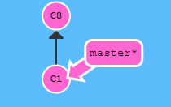
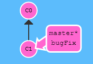
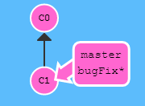
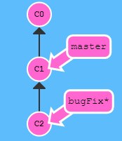
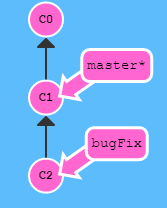
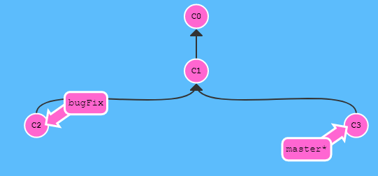
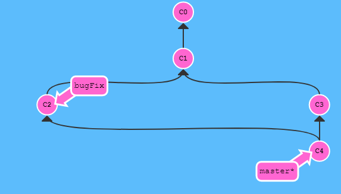

# Repository : 

A repository is like a folder for a project. Project's repository contains all of the project's files and stores each file's revision history. The file history is stored as a snapshot in time called commits.

# Clone:

**Clone** is used to create a local copy of a project that already eists remotely. Clone copies all the project files, branches and history.

### Example:
 
	* git clone <repo url>
	* git clone https://github.com/wseide/miniproject1.git

# Fork:

**Fork** is a copy of repository that developer manage and changes without affecting the original repository. The difference between fork and clone is that fork copy resides in github but clone copy resides in local machine

### Example:
 
	* On the github navigate to the repository
	* In the top right corner of the page click Fork

 # Branch:

**Branch** is separate from master which enables users to work locally and change made on the branch does not affect the master brach. Once all the changes in braches checked it can be added to the master and updated.

### Example:

	git checkout -b <branchname>
	git checkout -b Afreen

# Commit:

**Commit** saves the snapshot to the project history and completes the change tracking process. Anything that is changed will be staged by adding **git add** and it will become part of snapshot with git commit

### Example:

	git commit -m "Definition of commit added"

# Merge:

**Merge** is used to combine changes made on two distinct branches. A developer would merge when they want to combine changes in feature branch to master branch.

### Eample:

	git merge <feature_branch>
	git merge Afreen

# Checkout:

**Checkout** is used to switch between different versions of target entity. It operates upon three distinct entities- fils, commits and branches.

### Example:

	git checkout <branch_name>   (for switching branches)
	git checkout Afreen

	git checkout -b <branch_name> (create new branch)
	git checkout -b Afreen

# Push:

**Push** updates remote repository with any commits made locally to a branch. After a local repository has been modified a push is executed to share the modifications with remote team members.

### Example:

	git push <remote>
	git push origin master

# Pull:

**Pull** updates the local line of development with updates from its remote counterpart. Developers use this command if a teammate has made commits to a branch on a remote, and they would like to reflect those changes in their local environment.

### Example:

	git pull <remote_repo>
	git pull origin master

# Remote Add / Remove / Show:

**Remote** repositories are versions of a project that are hosted on the Internet or network somewhere. Managing remote repositories includes knowing how to add remote repositories, remove remotes that are no longer valid, show more information about a particular remote.

### Example:

	git remote add <name> <url>
	git remote remove <name>
	git remote show <remote>

# Status:

**Status** shows the status of changes as untracked, modified or stages.

### Example:

	git status

# Master Branch:

**Master** is a naming convention for a branch. After cloning (downloading) a project from a remote server, the resulting local repository has a single local branch: the so-called "master" branch. This means that "master" can be seen as a repository's "default" branch.

### Example:

	git push origin master (changes made to remote master branch)

# Git flow Workflow:

Gitflow Workflow is a Git workflow design that was first published and made popular by Vincent Driessen at nvie. The Gitflow Workflow defines a strict branching model designed around the project release. It dictates what kind of branches to set up and how to merge them together. It assigns very specific roles to different branches and defines how and when they should interact.

### Example:

  Here the Workflow diagram of how to create a new branch and commit on that branch and master branch and finally merge new branch to master branch is shown in the diagram.

 
 *master branch only*

 
 *bugFix branch created*

 
 *checkout to bugFix branch*

 
 *commit on bugFix branch*

 
 *checkout to master branch*

 
 *commit on master branch*

 
 *merge bugFix to master branch*

## Sources:

[source1](https://guides.github.com/introduction/git-handbook/) 

[Source2](https://www.atlassian.com/git/tutorials)

[Source3](https://guides.github.com/features/mastering-markdown/)

