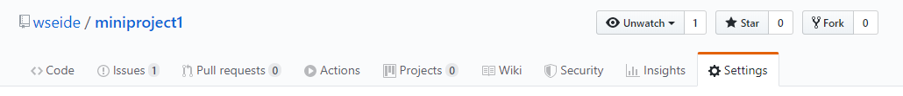
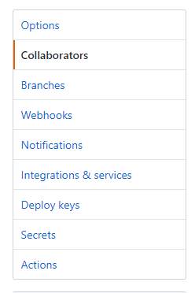
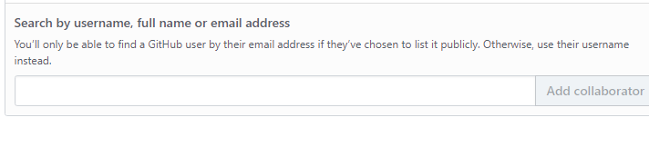

# Section 3

### To Setup GIT
Get a Github account from [Github](Github.com)
Download and install `git` onto your computer
Set up `git` with your `user name` and `email`

### Forking vs Cloning  
**Forking:** When you fork a repository you are copying the entire repository to your github account.  People use to make invoke a change to their repository or to use is as a starting point for their project.

To fork a repository go to that repository in Github. In the upper right corner click the fork image and you will copy the repository onto your account.

Check your repositories and you should see the forked repository on your Github account.

**Cloning:** When you clone a repository you are copying the repository onto your local machine. 

**To clone a repository from Github:**
1. Click the Clone or download
2. You have a choice to either download the repository to a zip file or you can clone using a password protected SSH Key
3. If you are cloning with SSH, ensure your public key is enabled and loaded.
4. Open your Terminal and change to the directory you want to clone your repository
5. Use command `git clone <name of repository>`
6. The repository and the alloted filed should be on your local machine

### Pull Request
**Pull Request:** We make pull request to make changes and/or collobrate to a repository.

To create 

### Adding a Collaborator to a Github Repository
To add a collaborator to a GitHub Repo:
1. Go to **Settings**

2. On the left hand side select **Collaborators**

3. You can add a collaborator by adding username, full name, or e-mail address

## Other Sections:
### Section 1
[Section 1](section1.md)

## Section 2
[Section 2](section2.md)

### Sources:
##### Mastering Markdown 
[Mastering Markdown Cheatsheet](https://github.com/adam-p/markdown-here/wiki/Markdown-Cheatsheet)

##### Github WIKI
[Github Wiki](https://help.github.com/en/github)

##### Git Branching - Basic Branching and Merging
[Git Branching](https://git-scm.com/book/en/v2/Git-Branching-Basic-Branching-and-Merging)

Collaborative Effort by:
1. **Afreen Farhana Uddin**
2. **Aman Trivedi**
3. **Wismy Seide**
